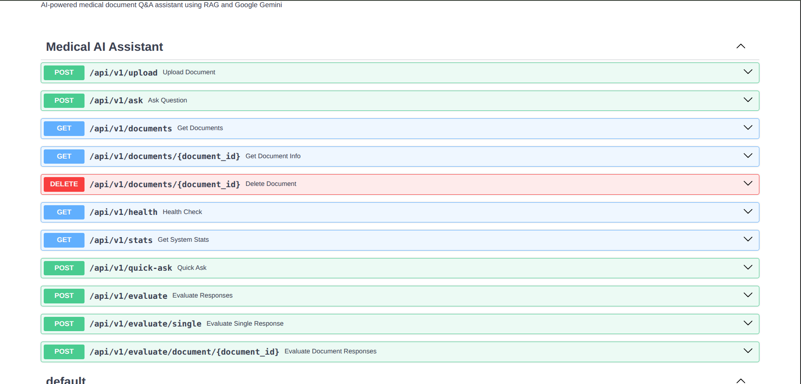
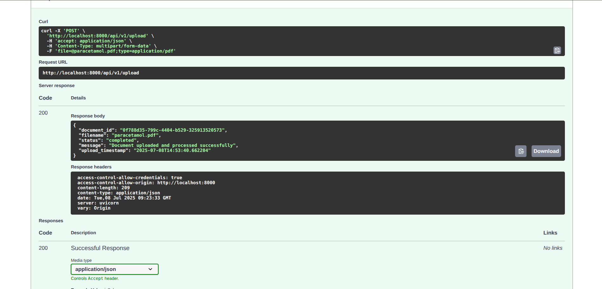
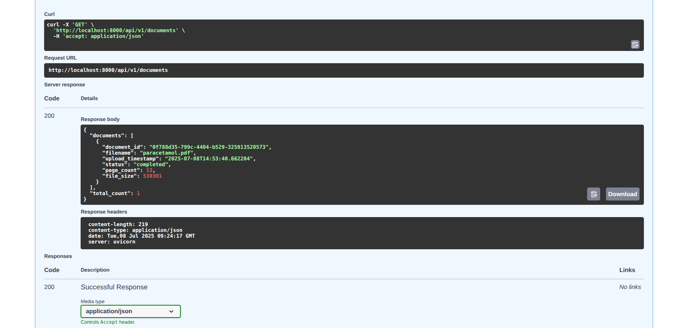
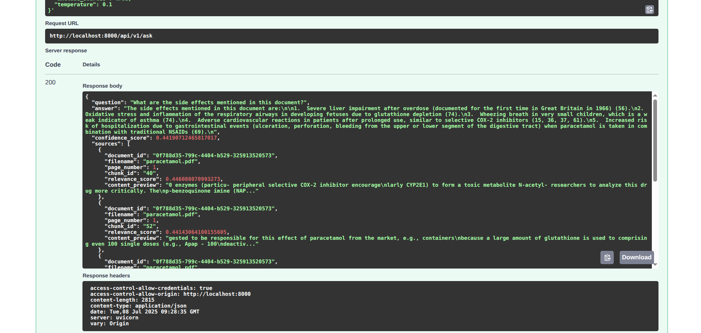

# 🏥 Medical AI Assistant

An intelligent medical document analysis system powered by **Google Gemini**, **FAISS**, and **RAGAS evaluation**. Upload PDF documents and get accurate, cited answers to medical questions using state-of-the-art RAG (Retrieval-Augmented Generation) technology.

## 🖼️ Screenshots

Here are example screenshots of the Medical AI Assistant:

- 
- 
- 
- 

## ✨ Features

### 🔍 **Document Intelligence**

- **PDF Upload & Processing**: Extract and index medical documents
- **Semantic Search**: Find relevant content using advanced embeddings
- **Multi-Document Support**: Query across multiple documents simultaneously

### 🤖 **AI-Powered Q&A**

- **Google Gemini 2.0**: Latest AI model for medical question answering
- **Source Citations**: Every answer includes document references
- **Context-Aware**: Understands medical terminology and concepts

### 📊 **Quality Assessment**

- **RAGAS Evaluation**: Comprehensive RAG pipeline evaluation using Google Gemini
- **Quality Metrics**: Faithfulness, relevancy, precision, and recall scores
- **Performance Monitoring**: Track system performance over time

### 🔧 **Developer-Friendly**

- **FastAPI Backend**: Modern, fast, and well-documented API
- **Interactive Docs**: Swagger UI and ReDoc for easy testing
- **Extensible Architecture**: Easy to customize and extend

## 🛠️ Technical Stack

- **Backend**: FastAPI (Python)
- **AI Model**: Google Gemini 2.0 Flash Experimental
- **Vector Store**: FAISS for similarity search
- **Embeddings**: Sentence Transformers (all-MiniLM-L6-v2)
- **Document Processing**: PDFPlumber for PDF text extraction
- **API Documentation**: Swagger UI / ReDoc

## 📋 Requirements

- Python 3.8 or higher
- Google Gemini API Key
- Virtual environment support
- 4GB+ RAM (recommended for vector operations)

## 🚀 Quick Start

### 1. Automatic Setup (Recommended)

```bash
git clone https://github.com/your-username/Medical-AI-Assistant.git
cd Medical-AI-Assistant
chmod +x setup.sh
./setup.sh
```

The setup script will:

- Create a Python virtual environment
- Install all dependencies
- Create necessary directories
- Set up environment configuration
- Start the application

### 2. Configure Environment

When prompted, edit the `.env` file and add your Gemini API key:

```bash
GEMINI_API_KEY=your_actual_api_key_here
```

Get your API key from: https://aistudio.google.com/

### 3. Access the Application

- **Main Application**: http://localhost:8000
- **API Documentation**: http://localhost:8000/docs
- **Alternative Docs**: http://localhost:8000/redoc

## 📖 Manual Setup

If you prefer manual setup:

### 1. Create Virtual Environment

```bash
python3 -m venv venv
source venv/bin/activate  # On Windows: venv\Scripts\activate
```

### 2. Install Dependencies

```bash
pip install --upgrade pip
pip install -r requirements.txt
```

### 3. Configure Environment

```bash
cp .env.example .env
# Edit .env and add your GEMINI_API_KEY
```

### 4. Create Directories

```bash
mkdir -p uploads data/vector_store data/documents static logs
```

### 5. Start Application

```bash
python3 main.py
```

## 🔧 API Usage

### Upload a Document

```bash
curl -X POST "http://localhost:8000/api/v1/upload" \
     -H "accept: application/json" \
     -H "Content-Type: multipart/form-data" \
     -F "file=@your_medical_document.pdf"
```

### Ask a Question

```bash
curl -X POST "http://localhost:8000/api/v1/ask" \
     -H "accept: application/json" \
     -H "Content-Type: application/json" \
     -d '{
       "question": "What are the side effects of this medication?",
       "document_id": "optional-specific-document-id"
     }'
```

### Evaluate RAG Performance

```bash
curl -X POST "http://localhost:8000/api/v1/evaluate" \
     -H "accept: application/json" \
     -H "Content-Type: application/json" \
     -d '{
       "questions": ["What are the symptoms?"],
       "generated_answers": ["Common symptoms include..."],
       "contexts": [["Medical context..."]]
     }'
```

### List Documents

```bash
curl -X GET "http://localhost:8000/api/v1/documents" \
     -H "accept: application/json"
```

### Health Check

```bash
curl -X GET "http://localhost:8000/api/v1/health" \
     -H "accept: application/json"
```

## 📁 Project Structure

```
Medical-AI-Assistant/
├── app/
│   ├── api/
│   │   ├── __init__.py
│   │   └── routes.py              # FastAPI routes
│   ├── core/
│   │   ├── __init__.py
│   │   └── app.py                 # Main application logic
│   ├── models/
│   │   ├── __init__.py
│   │   └── schemas.py             # Pydantic models
│   └── services/
│       ├── __init__.py
│       ├── document_processor.py  # PDF processing
│       ├── llm_service.py         # Gemini integration
│       └── vector_store.py        # FAISS vector operations
├── config/
│   ├── __init__.py
│   └── settings.py                # Configuration management
├── data/                          # Data storage
│   ├── documents/                 # Processed documents
│   └── vector_store/              # FAISS indices
├── uploads/                       # Uploaded files
├── static/                        # Static files
├── main.py                        # Application entry point
├── requirements.txt               # Python dependencies
├── .env.example                   # Environment template
├── start.sh                       # Startup script
└── README.md                      # This file
```

## 🔧 Configuration

Key environment variables in `.env`:

| Variable               | Description           | Default  |
| ---------------------- | --------------------- | -------- |
| `GEMINI_API_KEY`       | Google Gemini API key | Required |
| `HOST`                 | Server host           | 0.0.0.0  |
| `PORT`                 | Server port           | 8000     |
| `MAX_FILE_SIZE_MB`     | Max upload size       | 50       |
| `CHUNK_SIZE`           | Text chunk size       | 1000     |
| `CHUNK_OVERLAP`        | Chunk overlap         | 200      |
| `LLM_TEMPERATURE`      | AI creativity         | 0.1      |
| `SIMILARITY_THRESHOLD` | Search threshold      | 0.7      |

## 📊 API Endpoints

| Method   | Endpoint                        | Description                  |
| -------- | ------------------------------- | ---------------------------- |
| `GET`    | `/`                             | Main application page        |
| `POST`   | `/api/v1/upload`                | Upload PDF document          |
| `POST`   | `/api/v1/ask`                   | Ask question about documents |
| `POST`   | `/api/v1/quick-ask`             | Quick question (any topic)   |
| `GET`    | `/api/v1/documents`             | List all documents           |
| `GET`    | `/api/v1/documents/{id}`        | Get document details         |
| `DELETE` | `/api/v1/delete/documents/{id}` | Delete document              |
| `GET`    | `/api/v1/health`                | System health check          |
| `GET`    | `/api/v1/stats`                 | System statistics            |

## 🔍 Usage Examples

### Medical Document Analysis

1. **Upload a medical research paper**:

   - Use the `/upload` endpoint to upload a PDF
   - The system will extract text and create embeddings

2. **Ask specific questions**:

   - "What are the clinical trial results?"
   - "What dosage is recommended for elderly patients?"
   - "Are there any contraindications mentioned?"

3. **Get cited answers**:
   - Receive AI-generated answers with source references
   - View confidence scores and document sections

## 🧪 Testing

### Test Document Upload

```python
import requests

# Upload a test document
with open('test_document.pdf', 'rb') as f:
    response = requests.post(
        'http://localhost:8000/api/v1/upload',
        files={'file': f}
    )
print(response.json())
```

### Test Question Answering

```python
import requests

# Ask a question
response = requests.post(
    'http://localhost:8000/api/v1/ask',
    json={
        "question": "What are the main findings of this study?",
        "document_id": "your-document-id"
    }
)
print(response.json())
```

## 🐛 Troubleshooting

### Common Issues

1. **Import errors during startup**:

   - Ensure virtual environment is activated
   - Reinstall dependencies: `pip install -r requirements.txt`

2. **GEMINI_API_KEY not found**:

   - Check `.env` file exists and contains your API key
   - Verify the key is valid at Google AI Studio

3. **PDF processing fails**:

   - Ensure uploaded file is a valid PDF
   - Check file size (max 50MB by default)

4. **Memory issues**:
   - Increase available RAM
   - Reduce chunk size in configuration

### Debug Mode

Enable debug mode in `.env`:

```bash
DEBUG=true
LOG_LEVEL=DEBUG
```

## 🤝 Contributing

1. Fork the repository
2. Create a feature branch: `git checkout -b feature-name`
3. Make your changes
4. Add tests if applicable
5. Submit a pull request

## 📄 License

This project is licensed under the MIT License - see the LICENSE file for details.

## 🙏 Acknowledgments

- Google Gemini for AI capabilities
- FAISS for efficient vector search
- Sentence Transformers for embeddings
- FastAPI for the web framework
- PDFPlumber for PDF processing

## 📞 Support

For support, please:

1. Check the troubleshooting section
2. Review API documentation at `/docs`
3. Open an issue on GitHub
4. Check logs in the `logs/` directory

---

**Built with ❤️ for healthcare professionals and researchers**
